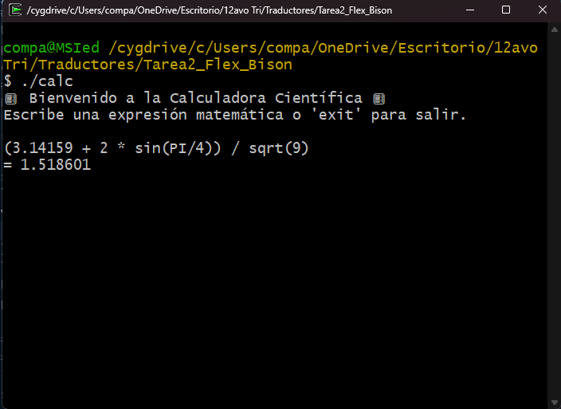
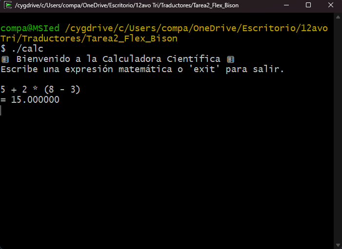
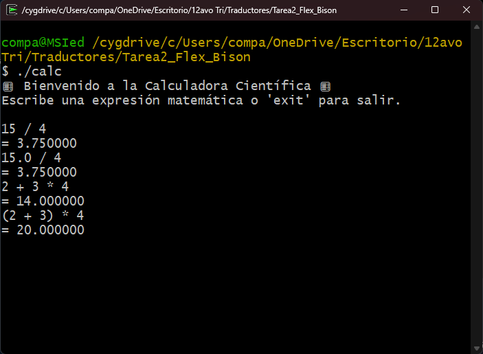
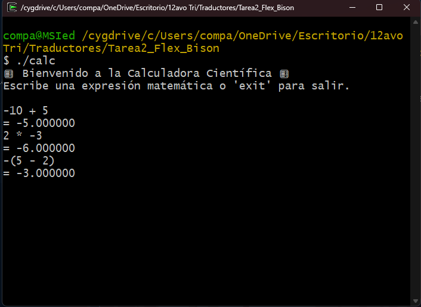
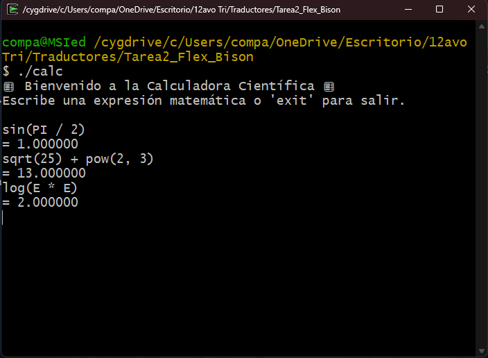
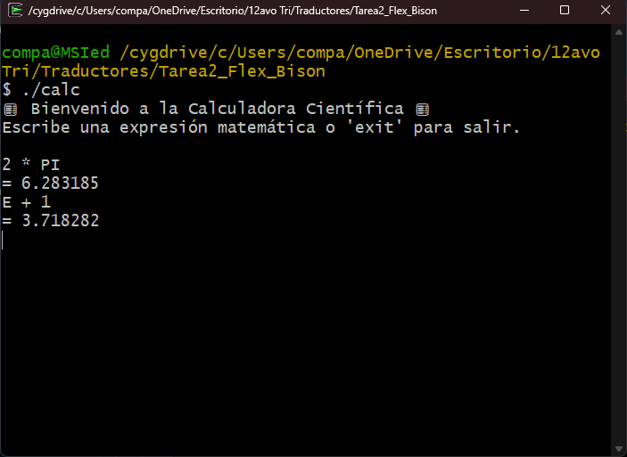
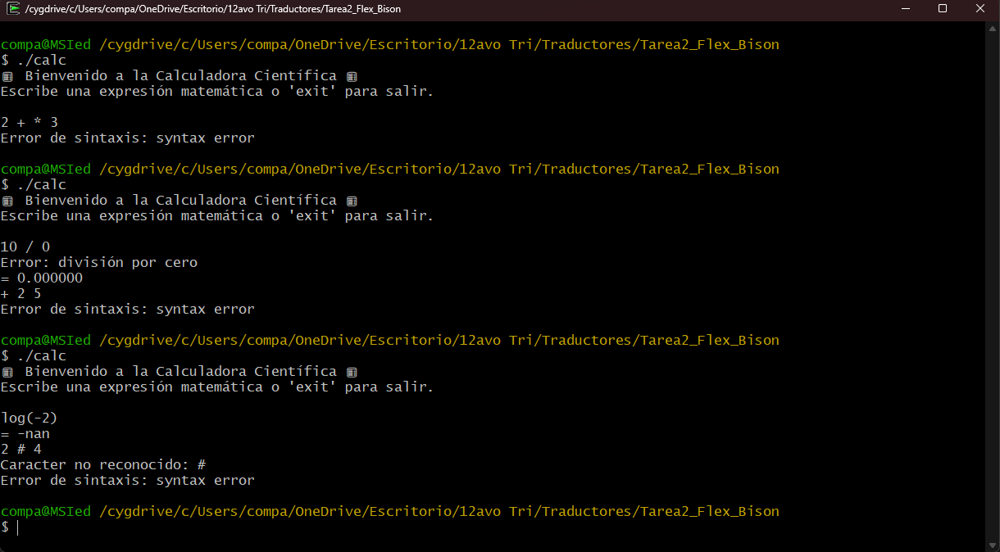
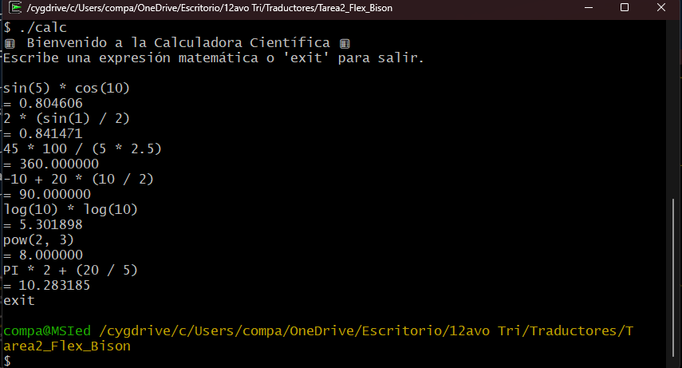

# 🧮 Calculadora Científica con Flex y Bison

### Alumno: Eduardo González  
### Matrícula: 2213064505  
### UEA: Traductores 25-P  
### Universidad Autónoma Metropolitana, Unidad Cuajimalpa

---

## 📌 Descripción general

Esta calculadora científica fue desarrollada usando **Flex** para el análisis léxico y **Bison** para el análisis sintáctico. Permite evaluar expresiones matemáticas complejas, respetando el orden de precedencia, incluyendo funciones trigonométricas, logarítmicas y constantes matemáticas predefinidas como `PI` y `E`.

---

## ⚙️ Estructura del proyecto

- `main.c`: Archivo principal que inicia la ejecución.
- `calc.l`: Código fuente de Flex, define el analizador léxico.
- `calc.y`: Código fuente de Bison, define la gramática y la semántica.
- `Makefile`: Permite compilar automáticamente todos los archivos.
- `README.md`: Este archivo.

---

## 🛠️ Instrucciones de compilación y ejecución

### Requisitos:
- Flex
- Bison
- GCC
- (Opcional) `make`

### Compilación automática:

```bash
make
```
Una vez compilado el proyecto, ejecuta la calculadora con:
```bash
./calc
```
Verás un mensaje de bienvenida. Ahora puedes escribir expresiones matemáticas y presionar Enter para ver el resultado.

## ✏️ Diseño léxico (Flex)
La calculadora reconoce los siguientes tokens mediante Flex:

* Números enteros y flotantes:
`[0-9]+` para enteros, `[0-9]+\.[0-9]+` para flotantes.
* Operadores aritméticos:
`+, -, *, /, %`
* Paréntesis y coma:
`(, ), ,`
* Funciones matemáticas:
`sin, cos, tan, log, log10, sqrt, pow`
* Constantes:
`PI, E`
* Comando de salida:
exit o quit
Ignora espacios y tabulaciones entre tokens.
Salto de línea se usa para indicar el final de una expresión.
## 📘 Explicación de la Gramática (Bison)

La gramática definida en `calc.y` permite analizar y evaluar expresiones matemáticas complejas. Está basada en una estructura recursiva que respeta la jerarquía de operadores y el uso de funciones científicas.

---

### 🎯 Objetivo de la gramática

Permitir que el usuario escriba expresiones como:

```text
(2 + 3) * sqrt(16) + sin(PI / 2)
```
### Reglas principales
* `input`: Permite procesar múltiples líneas de entrada, evaluando cada una por separado o finalizando si se ingresa `exit`.
```yacc
input:
    /* vacío */
  | input line
  ;
```
* `line`: Interpreta cada línea como una expresión válida o un comando de salida.
```yacc
line:
    expr '\n'     { printf("= %.6f\n", $1); }
  | EXIT '\n'     { exit(0); }
  | '\n'
  ;
```
* `expr`:

Contiene todas las posibles expresiones, incluyendo:
* Operaciones aritméticas: `+, -, *, /, %`
* Agrupamiento con paréntesis
* Negación unaria `(-x)`
* Constantes `PI y E`
* Funciones matemáticas como:
    * Trigonométricas: `sin, cos, tan`
    * Logarítmicas: `log, log10`
    * Raíz cuadrada: `sqrt`
    * Potencia: `pow(x, y)`

```yacc
input:
    /* vacío */
  | input line
  ;

line:
    expr '\n'     { printf("= %.6f\n", $1); }
  | EXIT '\n'     { exit(0); }
  | '\n'
  ;

expr:
    expr '+' expr   { $$ = $1 + $3; }
  | expr '-' expr   { $$ = $1 - $3; }
  | expr '*' expr   { $$ = $1 * $3; }
  | expr '/' expr   {
        if ($3 == 0) {
            fprintf(stderr, "Error: división por cero\n");
            $$ = 0;
        } else {
            $$ = $1 / $3;
        }
    }
  | expr '%' expr   { $$ = fmod($1, $3); }
  | '-' expr %prec UMINUS { $$ = -$2; }
  | '(' expr ')'    { $$ = $2; }
  | INT             { $$ = $1; }
  | FLOAT           { $$ = $1; }
  | PI_CONST        { $$ = M_PI; }
  | E_CONST         { $$ = M_E; }
  | SIN '(' expr ')'    { $$ = sin($3); }
  | COS '(' expr ')'    { $$ = cos($3); }
  | TAN '(' expr ')'    { $$ = tan($3); }
  | LOG '(' expr ')'    { $$ = log($3); }
  | LOG10 '(' expr ')'  { $$ = log10($3); }
  | SQRT '(' expr ')'   { $$ = sqrt($3); }
  | POW '(' expr ',' expr ')' { $$ = pow($3, $5); }
;
```
## 🔢 Precedencia y asociatividad
Se define mediante las siguientes directivas:
```yacc
%left '+' '-'
%left '*' '/' '%'
%right UMINUS
```
Esto asegura que, por ejemplo, la multiplicación y división tengan mayor prioridad que la suma y resta, y que el signo negativo se interprete correctamente como unario.
## ⚠️ Manejo de errores
Errores sintácticos y semánticos como:
* 2 + * 3 (error de sintaxis)
* 5 / 0 (división por cero)

son manejados con mensajes claros gracias a esta función:
```yacc
void yyerror(const char *s) {
    fprintf(stderr, "Error de sintaxis: %s\n", s);
}
```
Esta gramática fue diseñada para ser no ambigua, modular y extensible, permitiendo una evaluación correcta de expresiones científicas completas.

## 🧠 Demostración de Resultados
### Diseño Léxico y Sintáctico- Pregunta de verificación
`Pregunta de Verificación`: Proporciona ejemplos de cómo Flex reconocer ́a las siguientes secuencias de caracteres como tokens individuales, indicando el tipo de token para cada uno: `(3.14159 + 2 * sin(PI/4)) / sqrt(9)`

`Salida`:



### Gramática - Pregunta de verificación
`Pregunta de Verificación`: Demuestra la derivación para la expresión `5 + 2 * (8 - 3)` usando tu gramática. Identifica el punto en tu gramática donde se maneja la precedencia de operadores y la asociatividad.

La gramática define la precedencia y asociatividad de los operadores mediante directivas de Bison colocadas antes de las reglas, específicamente:


```yacc
%left '+' '-'
%left '*' '/' '%'
%right UMINUS
```
Estas directivas indican que:
* Los operadores `+ y -` son asociativos por la izquierda y tienen menor precedencia.
* Los operadores `*, / y % `también son asociativos por la izquierda, pero con mayor precedencia que la suma y resta
* El operador unario negativo `(-x)` tiene la mayor precedencia de todos, definido con %right UMINUS y usado explícitamente en la `regla:`
```yacc
| '-' expr %prec UMINUS { $$ = -$2; }
```
Esto asegura que expresiones como `-2 + 3 * 4` se interpreten correctamente como `(-2) + (3 * 4)` y que los paréntesis también alteren la evaluación según sea necesario.

`Salida`:



### Implementación y funcionalidad - Pregunta de verificación
`Pregunta de Verificación`: Muestra la salida de tu calculadora para las siguientes expresiones:
* `15 / 4`
* `15.0 / 4`
* `2 + 3 * 4`
* `(2 + 3) * 4`

`Salida`:



### Manejo de números negativos y unarios - Pregunta de verificación
`Pregunta de Verificación`: Muestra la salida de tu calculadora para
* `-10 + 5`
* `2 * -3`
* `-(5 - 2)`

`Salida`:



### Funciones matemáticas estándar - Pregunta de verificación
`Pregunta de Verificación`: Muestra la salida de tu calculadora para:
* `sin(PI / 2)` (donde PI es la constante definida en el siguiente punto)
* `sqrt(25) + pow(2, 3)`
* `log(E * E)` (donde E es la constante definida en el siguiente punto)

`Salida`:



### Constantes predefinidas - Pregunta de verificación
`Pregunta de Verificación`: Muestra la salida de tu calculadora para:
* `2 * PI`
* `E + 1`

`Salida`:



### Manejo de errores - Pregunta de verificación
`Pregunta de Verificación`: Proporciona ejemplos de entradas inv́alidas y la salida de error que tu calculadora genera. Incluye al menos un error sintáctico y uno semántico.

`Ejemplos`:

* Error de sintáxis: `2 + * 3`
* División por cero: `10 / 0`
* Error de sintáxis: `+ 2 5`
* Error semántico, logaritmo de número negativo: `log(-2)`
* Error de sintáxis, símbolo no reconocido: `2 # 4`

`Salida`:



## 🖼️ Interfaz de Usuario
### Pregunta de verificación
Incluye una captura de pantalla de una sesi ́on interactiva donde se ingresen al menos 3 expresiones diferentes y se finalice la calculadora.

`Salida`:

